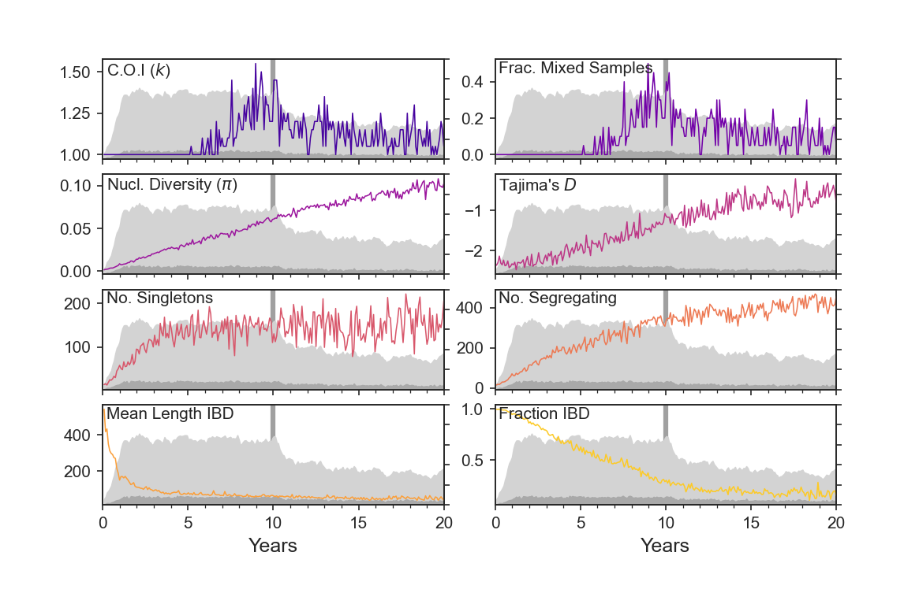

<p align="center"></p>

A **forward**-time simulation of malaria transmission and evolution: including **d**rift, **r**ecolonisation, **e**xtinction, **a**dmixture and **m**eiosis.

## Install
forward-dream is implemented in python and the dependencies can be installed using [conda](https://docs.conda.io/en/latest/):

```
git clone https://github.com/JasonAHendry/fwd-dream.git
cd fwd-dream
conda env create
conda activate dream
```

## Basic usage

NB: Usage is being updated

First, activate the conda environment:

```
conda activate dream
```

Then, in the `/fwd-dream` directory, run:

```
python simulation.py -e <expt_name> -p <params/param_set.ini> -s <clonal>
```

The `-e` flag specifies your experiment name, e.g. `-e high-transmission`.

The `-p` flag the path to your parameter set, which is an `.ini` file in the `/params` directory. In brief, this is how you set all the model parameters for `forward-dream`, and also how you specify different "Epochs" -- i.e. change parameter values *during* a simulation. See `/params/README.txt` for more details.

The `-s` flag specifies how the simulation should be seeded. At present, the simulation hard-coded to seeded with ten infected hosts (see line 328 of `simulation.py`), but the allelic states of the parasites can be `balanced`, `random`, or come from the output of another simulation `seed_dir`.

The simulation will run printing diagnostics to `stdout` in your terminal. Outputs will be deposited in `/results/<expt_name>`. In particular, `op.csv` will contain information about prevalence of hosts and vectors during the simulation, and `og.csv` will contain information about the genetic diversity of the parasite population.

### A small example

I've included an example parameter set (`params/param_default-example.ini`) and notebook (`notebooks/sec0_plot-default-example.ipynb`) for you to get started with `forward-dream`. The parameters are set such that the simulation runs with default parameters, but for only 10 years, such that you can run the simulation in a couple minutes on your local machine. To run it, navigate to the `/fwd-dream` directory and run:

```
conda activate dream
python simulation.py -e default -p params/param_default-example.ini -s clonal
```

The simulation should now print some diagnostics to `stdout`. Once the simulation is done, you should be able to run the notebook `notebooks/sec0_plot-default-example.ipynb` to produce plots that recreate Figure 2 of the `forward-dream` manuscript:




Note that ten years is not enough time for the population to reach genetic equilibrium. 


## Workflows

Below I describe the workflows I used to run the experiments described in the `forward-dream` manuscript. The workflows are specific to the [BMRC computer cluster at the University of Oxford](https://www.medsci.ox.ac.uk/divisional-services/support-services-1/bmrc/cluster-login). If you plan on re-running these experiments you will likely have to tailor these workflows to your specific cluster setup.

### Simulating variable host prevalence, by different epidemiological causes
One application of foward-dream is to look at differences in parasite genetic diversity at equilibrium, under different host prevalence regimes. Since we are often unsure of what drives host prevalence variation from region to region, we explore varying host prevalence by changing either (i) the vector biting rate, (ii) the vector density, or (iii) the average duration of infection. 

1. Run `notebooks/vary_host_prevalence.ipynb` to vary host prevalence using three different epidemiological parameters.
  - Input: `run_correlation.sh`; contains a base set of parameters from which to vary
  - Output: `run_vary_br.sh`, `run_vary_nv.sh`, `run_vary_gamma.sh`
2. Run `./run_vary_br.sh` to create parameter sets with variable `bite_rate_per_v`.
  - Input: `run_correlation.sh`
  - Calls: `vary_param_set.py`
  - Output: `param_bite_rate_per_v_00.ini`, ... `param_bite_rate_per_v_09.ini`
3. Move to the BMRC cluster.
4. Run `./run_correlations.sh -e 2020-04-10_br-correlation -v bite_rate_per_v -i 100 -s balanced`
  - Tags: `-e`, experiment name; `-v`, parameter being varied; `-i`, number of replicate simulations to run; `-s`, how to seed genomes in simulation
  - Input: `param_bite_rate_per_v_00.ini`, ... `param_bite_rate_per_v_09.ini`
  - Calls: `gen_submit.py`
  - Runs:  `./submit_simulation.sh`; **NB: this will immediately submit these simulations to the cluster.**
  - Output: in `/results/2020-04_br-correlation`; simulation results for the number of replicates indicated **and** for every parameter file conforming to `param_<bite_rate_per_v>_[\d].ini`
  
 Now you will have run a large number of simulations with different host prevalence values, achieved by varying a particular parameter. The next step is to aggregate and do some downstream analysis with these simulation results.
 
### Simulating malaria control interventionns
Another application of forward-dream is to explore how genetic diversity statistics behave in non-equilibrium contexts, for example following malaria control interventions. We simulate interventions by changing different simulation parameters, and then follow how a suite of genetic diversity statistics change through time.

1. Create parameter sets that simulate maalria control interventions.
  - I have created three already:
    - `params/param_artemisinin.ini`; vary host duration of infection
    - `params/param_bednets.ini`; vary vector biting rate
    - `params/param_insecticide.ini`; vary vector density
2. Run `gen_submit.py -e 2020-04-10_art-intv -p params/param_artemisinin.ini -i 100 -s balanced`
  - Input: `params/param_artemisinin.ini`
  - Output: `/submit-simulation.sh`; this will contain cluster submission for 100 replicate experiments.
3. Move to BMRC cluster.
4. Run `/submit-simulation.sh`
  - Output: `results/2020-04-10_art-inv` will contain simulation outputs for 100 replicate intervention experiments.

